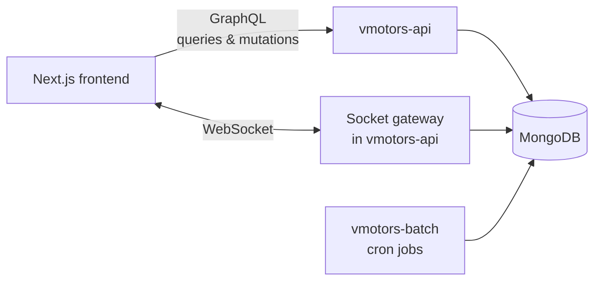

<div align="center">

# Santa — Backend

**NestJS + GraphQL API and scheduled ranking jobs for the Santa car marketplace.**

### [▶ Live demo: santacar.tech](http://santacar.tech) · [Frontend repository (screenshots & features)](https://github.com/khodiboev/vmotors-next)


</div>

## Overview

Santa is a marketplace for new Hyundai and Kia cars in South Korea. This repository is a **NestJS monorepo with two applications**:

| App | Role |
|---|---|
| `apps/vmotors-api` | GraphQL API: members and auth, vehicles, likes, views, comments, follows, community articles, notices, direct messages and notifications, plus a WebSocket gateway for real-time chat |
| `apps/vmotors-batch` | Background server with nightly cron jobs that recalculate vehicle and dealer rankings |

For the product overview, screenshots and the full feature list, see the [frontend repository](https://github.com/khodiboev/vmotors-next).

## Architecture



Each domain is a NestJS **module** with the same layers:

```
apps/vmotors-api/src/
├── main.ts                 validation pipe, logging interceptor, CORS, file uploads, WebSocket adapter
├── app.module.ts           GraphQL (Apollo, code-first schema), config, database, modules
├── components/             one folder per domain module
│   ├── auth/               JWT service, AuthGuard, RolesGuard, WithoutGuard, @AuthMember decorator
│   ├── member/  vehicle/  like/  view/  comment/  follow/
│   ├── board-article/      community articles
│   ├── notice/             notices and FAQ
│   └── notification/       direct messages, conversations, notifications
├── socket/                 WebSocket gateway
├── schemas/                Mongoose schemas
└── libs/                   DTOs (GraphQL input/output types), enums, validators, helpers
```

A request goes **resolver → service → Mongoose model → MongoDB**. Resolvers only handle GraphQL and authorization; business logic lives in services.

## GraphQL API

The schema is generated from TypeScript classes (**code-first**), so DTOs are both GraphQL types and validation rules (`class-validator`).

| Module | Queries | Mutations |
|---|---|---|
| **Member** | `getMember`, `getAgents`, `checkAuth`, `getAllMembersByAdmin` | `signup`, `login`, `updateMember`, `likeTargetMember`, `updateMemberByAdmin`, `imageUploader`, `imagesUploader` |
| **Vehicle** | `getVehicle`, `getVehicles`, `getFavorites`, `getVisited`, `getDealerVehicles`, `getAllVehiclesByAdmin` | `createVehicle`, `updateVehicle`, `likeTargetVehicle`, `updateVehicleByAdmin`, `removeVehicleByAdmin` |
| **Comment** | `getComments` | `createComment`, `updateComment`, `removeCommentByAdmin` |
| **Follow** | `getMemberFollowings`, `getMemberFollowers` | `subscribe`, `unsubscribe` |
| **Community** | `getBoardArticle`, `getBoardArticles`, `getAllBoardArticlesByAdmin` | `createBoardArticle`, `updateBoardArticle`, `likeTargetBoardArticle`, `updateBoardArticleByAdmin`, `removeBoardArticleByAdmin` |
| **Notice / FAQ** | `getNotices`, `getAllNoticesByAdmin` | `createNoticeByAdmin`, `updateNoticeByAdmin`, `removeNoticeByAdmin` |
| **Messages & notifications** | `getMyNotifications`, `getMyConversations`, `getConversation` | `sendMessage`, `updateMessage`, `readConversation`, `readNotification`, `readAllNotifications`, `fileUploader` |

**Vehicle search** (`getVehicles`) supports filters by brand, model, fuel type, transmission, location, price range, year range and listing date range, plus text search, sorting and pagination.

In development the GraphQL Playground is available at `http://localhost:3007/graphql`.

## Authentication and roles

- **JWT** issued on `signup` / `login`; passwords hashed with **bcrypt**.
- Three roles: `USER` (buyer), `AGENT` (dealer) and `ADMIN`.
- Guards applied per resolver method:
  - `AuthGuard` — the member must be logged in
  - `RolesGuard` + `@Roles(...)` — e.g. only `AGENT` can create vehicles, only `ADMIN` can moderate
  - `WithoutGuard` — public, but reads the token if present (for example to show whether the current user has liked a car)
- The WebSocket connection is authenticated with the same JWT (`?token=` query parameter).

## Real-time chat and notifications

The **socket gateway** keeps a map of connected clients and their members. It:

- broadcasts general chat messages and online/offline info to everyone connected;
- pushes a `notification` event only to the receiver of a direct message, a like or a comment;
- sends recent messages to a client when it connects.

Direct messages and notifications are also stored in MongoDB, so conversations, unread counters and "mark as read" work through the GraphQL API.

## Ranking jobs (vmotors-batch)

`@nestjs/schedule` runs three cron jobs every night:

| Time | Job | Logic |
|---|---|---|
| 01:00:00 | Rollback | Reset vehicle and dealer ranks to 0 |
| 01:00:20 | Top vehicles | `rank = likes × 2 + views` for available vehicles |
| 01:00:40 | Top dealers | `rank = vehicles × 5 + articles × 3 + likes × 2 + views` for active dealers |

The frontend uses these precomputed ranks for "Top ranked" badges and dealer rankings, so they are not recalculated on every request.

## Other details

- **File uploads** over GraphQL (`graphql-upload`, up to 10 files, 15 MB each); images are served from `/uploads`
- **Global validation** with `ValidationPipe` and a **logging interceptor** that logs every GraphQL request and its duration
- Migration history from the original real-estate template and design decisions are documented in [`docs/ai`](docs/ai)

## Tech stack

NestJS, GraphQL (Apollo Server, code-first), TypeScript, MongoDB / Mongoose, JWT, bcrypt, class-validator, WebSocket (`ws`), `@nestjs/schedule`, graphql-upload, Docker Compose.

## Run locally

Requirements: Node.js 20 and MongoDB.

```bash
git clone https://github.com/khodiboev/vmotors.git
cd vmotors
npm install
```

Create `.env`:

```
MONGO_DEV=mongodb://localhost:27017/santa
MONGO_PROD=<production connection string>
PORT_API=3007
PORT_BATCH=3008
SECRET_TOKEN=<random string, 32+ characters>
```

```bash
npm run start:dev          # API on http://localhost:3007/graphql
npm run start:dev:batch    # batch server
```

Production (Docker Compose, as on the server):

```bash
docker compose up -d       # vmotors-api on port 4001, vmotors-batch on port 4002
```

## Author

**Jurabek (Juno) Khodiboev** — full-stack developer in Seoul
[LinkedIn](https://www.linkedin.com/in/jurabek-khodiboev-4bab4427b) · [GitHub](https://github.com/khodiboev) · [Ask my AI assistant](https://ask.santacar.tech)
